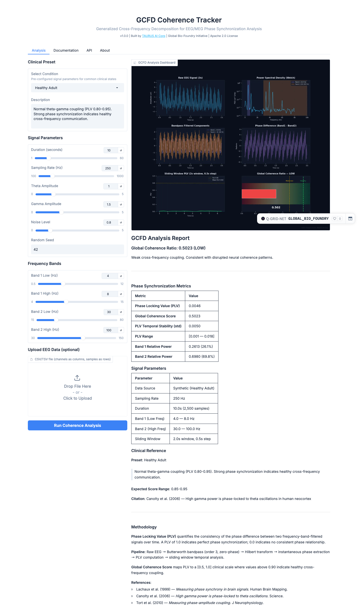

# GCFD Coherence Tracker — Product Requirements Document

**Version**: 1.0.0
**Date**: February 27, 2026
**Author**: TAURUS AI Corp
**Status**: Active
**Classification**: Public

> This document serves as a comprehensive product, market, and business strategy reference for the
> `taurus-gcfd-tracker` — an open-source EEG/MEG phase synchronization analysis library.
> Written for founders, investors, and partners who want the full picture without needing a PhD.

---

## Table of Contents

1. [Executive Summary](#1-executive-summary)
2. [Product Definition](#2-product-definition)
3. [Market Analysis](#3-market-analysis)
4. [Competitor Analysis](#4-competitor-analysis)
5. [Customer Segments & Revenue](#5-customer-segments--revenue)
6. [Go-To-Market Strategy](#6-go-to-market-strategy)
7. [Innovation & Prior Art](#7-innovation--prior-art)
8. [Legal & Regulatory](#8-legal--regulatory)
9. [Financial Projections](#9-financial-projections)
10. [Investment Thesis](#10-investment-thesis)
11. [Q&A — Frequently Asked Questions](#11-qa--frequently-asked-questions)
12. [Risk Analysis](#12-risk-analysis)
13. [Appendix](#13-appendix)

---

# 1. Executive Summary

## The One-Paragraph Pitch

**taurus-gcfd-tracker** is an open-source Python library that measures how well different brain
wave frequencies talk to each other — specifically, how well slow theta waves (4–8 Hz) synchronize
with fast gamma waves (30–100 Hz). This "cross-frequency coupling" is a biomarker for neurological
health: strong coupling means a healthy brain, weak coupling correlates with depression, Alzheimer's,
and other disorders. We give researchers a free, pip-installable tool to measure this, plus a hosted
API and clinical presets for pharma companies running drug trials. No MATLAB license required. No
$12,000 software seat. Just `pip install` and go.

## Key Numbers

| Metric | Value |
|--------|-------|
| **Direct addressable market (EEG analysis software)** | USD 605M (2024) → USD 1.19B (2033) |
| **Adjacent market (neurotechnology total)** | USD 15.8B (2025) → USD 29.7B (2030) |
| **Key competitor funding** | Beacon Biosignals: $121M total ($86M Series B, Nov 2025) |
| **Our advantage** | Open-source core + proprietary IP + hosted API + clinical presets |
| **Non-dilutive funding available (Canada)** | CAD 490K–1.26M Year 1 |
| **Seed ask** | $150K for pip package + v2.0 + first pharma pilot |

## Why This Matters

Three billion people worldwide have neurological disorders (WHO, 2021). The tools researchers use to
study brain signals are either:

1. **Locked behind MATLAB** — a $860+/year commercial license just to use the free toolboxes
2. **Expensive proprietary software** — $3,000–$12,000 per seat
3. **Enterprise-only platforms** — Beacon Biosignals charges pharma companies but publishes nothing

We sit in the gap: **free for researchers, paid for enterprise, with clinical presets no one else has.**

---

# 2. Product Definition

## 2.1 What It Does (Plain English)

Your brain produces electrical signals at different frequencies — think of them as radio stations. Slow
waves (theta, 4–8 Hz) carry long-range communication between brain regions. Fast waves (gamma,
30–100 Hz) handle local processing. When these frequencies are "phase-locked" — when the peaks and
troughs align in a predictable pattern — that's a sign of a healthy, well-connected brain.

**taurus-gcfd-tracker** measures this phase-locking. Specifically:

1. **Takes raw EEG data** (a time series of voltage measurements from scalp electrodes)
2. **Filters it into frequency bands** (theta and gamma by default, configurable)
3. **Extracts the instantaneous phase** using the Hilbert transform
4. **Calculates the Phase Locking Value (PLV)** — how consistently the two frequencies align
5. **Outputs a Global Coherence Score** from 0.0 to 1.0

The result is a single number that tells you: *how well is this brain coordinating?*

## 2.2 How Results Convert to Value

| Score Range | Clinical Status | What It Means | Who Cares |
|-------------|----------------|---------------|-----------|
| 0.90–1.00 | HEALTHY | Strong theta-gamma coupling; normal coordination | Baseline reference |
| 0.70–0.89 | MODERATE | Partial synchronization; sub-clinical | Wellness companies, early detection |
| < 0.70 | LOW | Weak coupling; correlates with MDD, MCI, ADHD | Pharma (drug trials), clinicians |
| > 0.95 | HYPER | Pathological hypersynchronization | Epilepsy researchers |

**The money is in the LOW scores.** A pharma company running a depression drug trial needs to measure
whether their drug improves theta-gamma coupling. Currently, they either:
- Pay Beacon Biosignals (enterprise pricing, opaque)
- Hire an EEG PhD to write custom MATLAB scripts
- Use MNE-Python but build their own clinical pipeline from scratch

We package the whole pipeline — data in, coherence score out — with clinical presets for 8 conditions.

## 2.3 Technical Architecture

```
┌─────────────────────────────────────────────────────────────────┐
│                    taurus-gcfd-tracker Pipeline                 │
├─────────────────────────────────────────────────────────────────┤
│                                                                 │
│  Raw EEG Signal (numpy array or CSV)                            │
│       │                                                         │
│       ▼                                                         │
│  ┌─────────────────────────────────────┐                        │
│  │ Butterworth Bandpass Filter (Order 3)│                        │
│  │ • Zero-phase (filtfilt)             │                        │
│  │ • Band 1: Theta (4-8 Hz)           │                        │
│  │ • Band 2: Gamma (30-100 Hz)        │                        │
│  └──────────────┬──────────────────────┘                        │
│                 │                                                │
│                 ▼                                                │
│  ┌─────────────────────────────────────┐                        │
│  │ Hilbert Transform                   │                        │
│  │ → Extract instantaneous phase       │                        │
│  │ → For each frequency band           │                        │
│  └──────────────┬──────────────────────┘                        │
│                 │                                                │
│                 ▼                                                │
│  ┌─────────────────────────────────────┐                        │
│  │ Phase Locking Value (PLV)           │                        │
│  │ PLV = |mean(e^(i·Δφ))|             │                        │
│  │ Where Δφ = phase1 - phase2          │                        │
│  └──────────────┬──────────────────────┘                        │
│                 │                                                │
│                 ▼                                                │
│  ┌─────────────────────────────────────┐                        │
│  │ Global Coherence Score [0.0 - 1.0]  │                        │
│  │ • Normalized PLV metric             │                        │
│  │ • Sliding window analysis           │                        │
│  │ • Clinical threshold classification │                        │
│  └─────────────────────────────────────┘                        │
│                                                                 │
│  Outputs: Score, Classification, Temporal Plot, Spectral Plot   │
│                                                                 │
└─────────────────────────────────────────────────────────────────┘
```

**Dependencies:** `numpy`, `scipy`, `matplotlib` (core) | `gradio` (web app) | No MATLAB, no GPU.

### Interfaces

| Interface | How to Access | Rate Limit |
|-----------|---------------|------------|
| **Python library** | `from taurus_gcfd import CoherenceTracker` | Unlimited (local) |
| **Gradio web app** | [HuggingFace Space](https://huggingface.co/spaces/Taurus-Ai-Corp/gcfd-coherence-tracker) | HF rate limits |
| **Gradio API** | `gradio_client.Client("Taurus-Ai-Corp/gcfd-coherence-tracker")` | 50 req/day (free) |
| **CLI** | `python taurus_gcfd.py` | Unlimited (local) |

## 2.4 Feature Roadmap

### v1.0 (Current — February 2026)

- [x] CoherenceTracker class with PLV-based theta-gamma coupling
- [x] 8 clinical presets (Healthy, MDD, MCI/Alzheimer's, Epilepsy, Meditation, Anesthesia, ADHD, Custom)
- [x] Gradio web dashboard with interactive parameter controls
- [x] CSV upload for custom EEG data
- [x] Hosted on HuggingFace Spaces
- [x] Apache 2.0 open-source + Enterprise license
- [x] CI/CD (GitHub Actions: lint + test + IP guard)
- [x] API access via gradio_client

### v2.0 (Target: Q3 2026)

- [ ] `pip install taurus-gcfd` on PyPI
- [ ] MNE-Python plugin (`mne.io` loader compatibility)
- [ ] Multi-channel support (64-channel EEG montages)
- [ ] Batch processing API (process N files, return N scores)
- [ ] Export to BIDS format (Brain Imaging Data Structure)
- [ ] Phase-Amplitude Coupling (PAC) module alongside PLV
- [ ] Performance benchmarks against MNE and EEGLAB
- [ ] Docker container for reproducible analysis

### v3.0 (Target: Q1 2027)

- [ ] Real-time streaming API (WebSocket)
- [ ] Longitudinal coherence tracking (time-series of scores)
- [ ] Integration with OpenBCI and Muse hardware
- [ ] Proprietary quantum biology layer (closed-source module)
- [ ] FDA Research Use Only (RUO) compliance package
- [ ] Enterprise SSO and audit logging
- [ ] SLA-backed hosting (99.9% uptime)

---

# 3. Market Analysis

> All market data sourced from published reports. Source citations in [Appendix](#13-appendix).
> Numbers represent our best aggregation across multiple research firms where ranges exist.

## 3.1 Total Addressable Market (TAM)

The GCFD Coherence Tracker sits at the intersection of four markets:

```
┌────────────────────────────────────────────────────────────┐
│                    NEUROTECHNOLOGY                         │
│                    USD 15.8B (2025)                        │
│                    → USD 29.7B (2030)                      │
│                    CAGR: 13.53%                            │
│   ┌────────────────────────────────────────────────────┐   │
│   │              EEG DEVICES                           │   │
│   │              USD 1.41B (2024)                      │   │
│   │              → USD 3.65B (2034)                    │   │
│   │              CAGR: 10.24%                          │   │
│   │   ┌────────────────────────────────────────────┐   │   │
│   │   │        EEG ANALYSIS SOFTWARE               │   │   │
│   │   │        USD 605M (2024)                     │   │   │
│   │   │        → USD 1.19B (2033)                  │   │   │
│   │   │        CAGR: 7.8%                          │   │   │
│   │   │   ┌────────────────────────────────────┐   │   │   │
│   │   │   │    OUR SAM (Serviceable)           │   │   │   │
│   │   │   │    ~USD 120M (2024)                │   │   │   │
│   │   │   │    Research tools + API + SaaS     │   │   │   │
│   │   │   └────────────────────────────────────┘   │   │   │
│   │   └────────────────────────────────────────────┘   │   │
│   └────────────────────────────────────────────────────┘   │
└────────────────────────────────────────────────────────────┘
```

### TAM / SAM / SOM Breakdown

| Level | Market | Size (2024) | Growth | How We Address It |
|-------|--------|-------------|--------|-------------------|
| **TAM** | All EEG Analysis Software | USD 605M | 7.8% CAGR | Anyone analyzing EEG signals |
| **SAM** | Research + Clinical Trial EEG Tools | ~USD 120M | ~10% CAGR | Labs and pharma needing phase coupling |
| **SOM** | Year 1 Realistic Capture | ~USD 500K–2M | — | Academic pip installs + first enterprise pilot |

**SAM Rationale:** ~20% of the EEG software market involves phase synchronization or cross-frequency
analysis — the rest is raw signal visualization, artifact rejection, or source localization that we
don't currently address.

## 3.2 Market Size by Segment

### EEG Device & Software Market

| Metric | Value | Source |
|--------|-------|--------|
| 2024 Market Size (devices) | USD 1.41 billion | Precedence Research |
| 2034 Projection (devices) | USD 3.65 billion | Precedence Research |
| CAGR (2025–2034) | 10.24% | Polaris Market Research |
| 2024 EEG Analysis Software | USD 605 million | Business Research Insights |
| 2033 EEG Analysis Software | USD 1.19 billion | Business Research Insights |
| Software CAGR | 7.8% | Business Research Insights |

**What's driving this:** The shift from hospital-grade EEG ($50K+ systems) to consumer-grade EEG
headbands ($200–$400 from Muse, OpenBCI, Emotiv) is expanding the market from ~50,000 clinical
labs to millions of individual researchers and biohackers.

### Neurotechnology Market (Parent Market)

| Metric | Value | Source |
|--------|-------|--------|
| 2025 Market Size | USD 15.77 billion | Mordor Intelligence |
| 2030 Projection | USD 29.74 billion | Mordor Intelligence |
| 2034 Projection | USD 52.86 billion | Precedence Research |
| CAGR (2025–2030) | 13.53% | Mordor Intelligence |
| North America Share (2024) | 39.62% of revenue | Precedence Research |
| Asia-Pacific CAGR | 15.46% (fastest-growing) | Precedence Research |

**Why it matters:** 3 billion+ people worldwide have neurological disorders (WHO, 2021). Every
new neurotechnology device needs software to analyze the signals it produces. As hardware
proliferates, software demand follows.

### CNS Biomarker Market

| Metric | Value | Source |
|--------|-------|--------|
| 2024 Market Size | USD 4.81 billion | Credence Research |
| 2030 Projection | USD 8.73 billion | Market Data Forecast |
| CAGR | 9.8–10.39% | Multiple reports |

**Why it matters:** EEG-derived biomarkers (like our theta-gamma coherence score) are becoming
the standard for measuring treatment response in CNS drug trials. The FDA increasingly
expects quantitative biomarker data in drug approval submissions.

### Neurofeedback Market

| Metric | Value | Source |
|--------|-------|--------|
| 2024 Market Size | USD 1.35 billion | Data Bridge Market Research |
| 2032 Projection | USD 2.35 billion | Data Bridge Market Research |
| CAGR | 7.18% | Data Bridge Market Research |

**Why it matters:** Neurofeedback requires real-time coherence measurement — the exact
pipeline we provide. Neurofeedback platforms are potential OEM customers.

### Brain-Computer Interface (BCI) Market

| Metric | Value | Source |
|--------|-------|--------|
| 2024 Market Size | USD 2.65–2.93 billion | Multiple reports |
| 2034 Projection | USD 12.87–16.66 billion | Multiple reports |
| Consensus CAGR | ~17% | Average across 5 reports |

**Why it matters:** This is the fastest-growing segment in all of neurotechnology. Every BCI
product needs signal coherence analysis to validate that the brain signal is being decoded
correctly.

### Neurology Clinical Trials Market

| Metric | Value | Source |
|--------|-------|--------|
| 2024 Market Size | USD 5.84 billion | Grand View Research |
| 2030 Projection | USD 8.42 billion | Grand View Research |
| 2034 Projection | USD 10.14 billion | Precedence Research |
| CAGR (2025–2034) | 5.58% | Precedence Research |
| CNS Drug Pipeline Share | 14% of total industry pipeline | IQVIA (2024) |

**Why it matters:** 14% of all drugs in development target the central nervous system. Each
of those trials can use our coherence tracker to measure treatment effect on brain connectivity.

## 3.3 Market Summary

| Market | 2024 Size | Projected | CAGR | Our Play |
|--------|-----------|-----------|------|----------|
| EEG Devices | USD 1.41B | USD 3.65B (2034) | 10.24% | Software layer on expanding hardware base |
| EEG Analysis Software | USD 605M | USD 1.19B (2033) | 7.8% | **Direct competitor** |
| Neurotechnology Total | USD 15.8B | USD 29.7B (2030) | 13.53% | Parent market rising tide |
| CNS Biomarkers | USD 4.81B | USD 8.73B (2030) | 10.39% | Our output IS a biomarker |
| Neurofeedback | USD 1.35B | USD 2.35B (2032) | 7.18% | OEM integration opportunity |
| BCI | USD 2.75B | USD 14.8B (2034) | ~17% | Signal validation layer |
| Neuro Clinical Trials | USD 5.84B | USD 10.14B (2034) | 5.58% | Enterprise pharma sales |

**Combined addressable opportunity:** ~USD 9.5B (2024) growing to ~USD 25B+ (2034).

---

# 4. Competitor Analysis

## 4.1 Landscape Overview

The EEG analysis tool market has a distinctive structure: a few open-source tools dominate academia
(but require MATLAB or significant setup), while enterprise solutions are opaque and expensive.

### Feature Comparison Matrix

| Feature | **GCFD Tracker** | MNE-Python | EEGLAB | BrainVision | FieldTrip | Brainstorm | Beacon Biosignals |
|---------|:---:|:---:|:---:|:---:|:---:|:---:|:---:|
| **Language** | Python | Python | MATLAB | Windows-only | MATLAB | MATLAB/Java | Python (proprietary) |
| **License** | Apache 2.0 | BSD | GPL (needs MATLAB) | Commercial | GPL (needs MATLAB) | GPL (needs MATLAB) | Enterprise only |
| **Cost** | Free / $29-149/mo | Free | Free (+ $860+/yr MATLAB) | ~$3K-12K/seat | Free (+ MATLAB) | Free (+ MATLAB) | Enterprise pricing |
| **pip installable** | Yes (planned v2.0) | Yes | No | No | No | No | No |
| **Hosted API** | Yes (HuggingFace) | No | No | No | No | No | Yes (private) |
| **Clinical Presets** | 8 conditions | No | No | No | No | No | Custom per client |
| **Cross-Frequency Coupling** | Core feature | Available (separate) | Via plugin | Limited | Via scripts | Limited | Proprietary |
| **Web Dashboard** | Yes (Gradio) | No | No | No | No | No | Yes (private) |
| **Real-time capable** | v3.0 roadmap | LSL integration | No | No | Yes | No | Yes |
| **CSV Upload** | Yes | Via pandas | Yes | Proprietary format | Proprietary format | Yes | API upload |
| **Active Development** | Yes (2026) | Yes (v1.11) | Yes | Yes | Yes (monthly) | Yes | Yes |

### User Base Comparison

| Tool | Users/Downloads | Key Metric | Community |
|------|----------------|------------|-----------|
| **MNE-Python** | ~33K weekly PyPI downloads | ~3,084 GitHub stars | Very active, Python-native |
| **EEGLAB** | ~20,464 Google Scholar citations | Global standard since 2004 | Largest academic footprint |
| **BrainVision** | Unknown (commercial) | ~500 EUR educational license | Proprietary, lab-bound |
| **FieldTrip** | 754 GitHub stars, 939 forks | Standard for MEG | Active mailing list |
| **Brainstorm** | Active MEG/EEG community | MATLAB + Java | GUI-focused |
| **Beacon Biosignals** | 200,000+ hours of EEG training data | $121M total funding | Enterprise pharma |
| **GCFD Tracker (ours)** | New (launched Feb 2026) | CI passing, HF Space live | Building |

## 4.2 Key Competitor: Beacon Biosignals

Beacon Biosignals is the closest market analog — and the validation proof for our thesis.

| Attribute | Beacon Biosignals | GCFD Tracker |
|-----------|-------------------|--------------|
| **Founded** | 2019 | 2026 |
| **Total Funding** | $121M ($86M Series B, Nov 2025) | $0 (bootstrapped) |
| **Lead Investors** | GV, Innoviva, Nexus NeuroTech, General Catalyst | — |
| **Core Product** | FDA-cleared Waveband EEG headband + AI platform | Open-source coherence tracker + API |
| **Data Scale** | 200,000+ hours of EEG data | Synthetic + user-uploaded |
| **Revenue Model** | Enterprise SaaS to pharma | Open-core + API tiers |
| **Approach** | Proprietary AI, closed ecosystem | Open science, reproducible methods |
| **Primary Customer** | Pharma companies (Harmony Biosciences, etc.) | Researchers → growing to pharma |

**What Beacon's $86M proves:**
1. Investors believe EEG AI is a $1B+ opportunity
2. Pharma will pay for EEG-derived biomarkers
3. The bottleneck is software + analysis, not hardware
4. There's room for an open-source alternative

**Our differentiation from Beacon:**
- They are closed; we are open (academia wants reproducibility)
- They require hardware (Waveband headband); we are hardware-agnostic
- They serve top-10 pharma; we serve the other 5,000 neurotech labs
- They have 200K hours of data; we provide the *tools* to generate insights from any data

## 4.3 Key Competitor: MNE-Python

MNE-Python is the most direct open-source competitor. It does what we do and much more.

**Why we still win:**

| MNE-Python Challenge | Our Advantage |
|---------------------|---------------|
| Cross-frequency coupling requires chaining 5+ modules manually | One function call: `tracker.calculate_global_coherence(data)` |
| No clinical presets — researchers must know the literature | 8 clinical presets built-in (MDD, Alzheimer's, Epilepsy, etc.) |
| No hosted API — every user must install locally | Hosted on HuggingFace Spaces with API endpoint |
| No web dashboard | Gradio dashboard with interactive controls |
| Generic tool covering all EEG analysis | Focused tool optimized for cross-frequency coupling |
| Documentation assumes EEG expertise | Plain-English interpretation of results |

**Why MNE still wins in some areas:**

| Our Limitation | MNE-Python Strength |
|----------------|---------------------|
| Single-channel only (v1.0) | Full 64/128/256 channel support |
| No source localization | Full inverse problem solving |
| No ICA artifact rejection | Comprehensive artifact removal |
| No BIDS integration yet | Full BIDS-compliant workflows |
| New, unvalidated | 20 years of academic validation |

**Strategy:** We don't compete with MNE — we complement it. v2.0 will be an MNE plugin,
meaning researchers can use MNE for preprocessing and our library for cross-frequency analysis.

## 4.4 The MATLAB Problem

Three of the top five EEG tools (EEGLAB, FieldTrip, Brainstorm) require MATLAB. This is a
structural market opportunity:

- **MATLAB Individual License**: $860/year (home) or $2,350/year (commercial)
- **MATLAB Academic License**: ~$500/year (varies by institution)
- **Student License**: $49/year (expires at graduation)
- **MATLAB Online**: Limited functionality, additional cost

**The migration is happening now.** Every year, more PhD students learn Python instead of MATLAB.
Every lab that switches to Python needs Python-native EEG tools. MNE-Python is the primary
beneficiary, and our library rides the same wave as an MNE-compatible plugin.

> "When MATLAB was the only game in town, EEGLAB was the only choice. Now there are choices,
> and labs are choosing Python." — Pattern observed across neuroscience departments globally

## 4.5 Competitive Advantages (Our Five Differentiators)

1. **Clinical Presets**: No other open-source tool ships with condition-specific parameter sets
   for MDD, Alzheimer's, Epilepsy, etc. Researchers save hours of literature review.

2. **Hosted API**: The only open-source EEG coherence tool available as a hosted API endpoint.
   No installation required — call from any language via HTTP.

3. **One-Function Interface**: `calculate_global_coherence(data)` — a single function that does
   what takes 50+ lines of code in MNE-Python.

4. **Proprietary Research Foundation**: Open-source core built on private quantum biology research
   that creates a knowledge moat competitors cannot replicate without starting from scratch.

5. **Enterprise License Path**: Apache 2.0 for research + explicit enterprise license for commercial
   use. This is the exact model that works for MongoDB, Redis, and Elastic.

## 4.6 Honest Assessment — Pros and Cons

### What We Do Well (Pros)

| Strength | Evidence |
|----------|----------|
| Simplicity | Single function call vs. 50+ lines in alternatives |
| Accessibility | Web dashboard requires zero installation |
| Clinical focus | 8 presets that no competitor offers |
| Modern Python | No MATLAB dependency |
| Open source + API | Only tool offering both |
| Active CI/CD | GitHub Actions, IP guard, automated testing |
| Backed by proprietary research | Private quantum biology vault with timestamped prior art |

### What We Need to Improve (Cons)

| Weakness | Plan to Address | Timeline |
|----------|-----------------|----------|
| Single-channel only | Multi-channel support in v2.0 | Q3 2026 |
| No pip package yet | PyPI release in v2.0 | Q3 2026 |
| No academic validation | Publish benchmarks + JOSS paper | Q4 2026 |
| Small user base | Conference demos + academic outreach | 2026–2027 |
| No real EEG data partnerships | Approach PhysioNet, Temple University Hospital | Q3 2026 |
| No ICA/artifact rejection | MNE plugin integration (use MNE for preprocessing) | v2.0 |
| Single developer/org | Hire via Mitacs + NSERC Alliance | H2 2026 |

---

# 5. Customer Segments & Revenue

## 5.1 Customer Tiers

### Tier 1: Pharma & Biotech — $50K–$500K/year

**Who:** Large pharmaceutical companies running CNS drug trials. Companies like Eli Lilly (Alzheimer's),
Harmony Biosciences (hypersomnia), Johnson & Johnson (depression), Biogen (neurodegeneration).

**What they need:**
- Quantitative EEG biomarker for treatment response
- Batch processing of trial participant data (1,000+ subjects)
- SLA-backed API with audit logging
- Integration with their clinical data management systems (EDC/CDMS)
- Regulatory documentation (RUO compliance)

**How we reach them:**
- Conference demos at SfN 2026 (22,000+ attendees)
- Published benchmarks showing equivalence or superiority to current methods
- Enterprise license with dedicated support

**Revenue potential:**
- 14% of all drugs in development target CNS (IQVIA, 2024)
- The neurology clinical trials market is $5.84B and growing
- A single pharma pilot contract: $50K–$150K
- A multi-trial enterprise deal: $200K–$500K/year

**Comparable pricing:** Beacon Biosignals charges enterprise rates for their platform, reportedly
in the $100K–$500K range per engagement for pharma clients.

### Tier 2: Neurotech Companies — $10K–$100K/year

**Who:** Companies building BCI devices, neurofeedback platforms, or consumer EEG products.
Companies like Neurable, Kernel, Muse (InteraXon), OpenBCI, Neurosity.

**What they need:**
- OEM license to embed coherence analysis in their product
- Real-time processing capability (v3.0)
- Custom frequency band configurations
- White-label API endpoint
- Technical integration support

**How we reach them:**
- Direct outreach to product teams
- Open-source adoption leading to commercial licensing
- Neurotech Slack communities and conferences

**Revenue potential:**
- OEM license: $10K–$50K/year base + per-device royalty
- API usage: $50K–$100K/year for high-volume products
- The BCI market alone is growing at 17% CAGR

### Tier 3: Academic & Research Labs — $0–$149/month

**Who:** University neuroscience labs, PhD students, postdoctoral researchers, independent
researchers. There are approximately 5,000+ neuroscience labs worldwide.

**What they need:**
- Free, pip-installable Python library
- Reproducible results for paper publication
- MNE-Python compatibility
- CSV data upload for custom experiments
- API access for computational experiments

**How we reach them:**
- PyPI distribution (`pip install taurus-gcfd`)
- conda-forge packaging
- MNE plugin ecosystem listing
- JOSS (Journal of Open Source Software) publication
- Conference poster presentations

**Revenue model:**

| Tier | Rate Limit | Price | Target User |
|------|-----------|-------|-------------|
| Free | 50 API req/day | $0/month | Students, casual exploration |
| Researcher | 1,000 API req/day | $29/month | Active lab researchers |
| Clinical | 10,000 req/day + batch | $149/month | Lab leads running studies |

**Why the free tier matters:** Every PhD student who uses our tool for free becomes a potential
enterprise customer when they move to pharma in 3–5 years. This is the Weights & Biases
playbook (free for academics → paid in industry).

### Tier 4: Government & Defense — $100K–$1M/year

**Who:** Military research labs (DARPA, DND Canada, NATO), intelligence agencies, and government
health agencies (NIH, CIHR).

**What they need:**
- On-premise deployment (not cloud)
- Security compliance (FedRAMP, ITAR)
- Long-term support contracts (3–5 years)
- Custom integration with classified systems

**How we reach them:**
- SBIR/STTR proposals (US)
- Canadian defence innovation programs (IDEaS)
- Security clearance requirements (future consideration)

**Revenue potential:**
- Government contracts typically $100K–$1M annually
- Multi-year terms with built-in escalation
- Defense neurotechnology spending is increasing globally

### Tier 5: Consumer Wellness (Future — v3.0+)

**Who:** Direct-to-consumer wellness platforms, meditation apps, biohacker communities.

**What they need:**
- Simple coherence score ("your brain health today: 87/100")
- Real-time streaming from consumer headbands (Muse, OpenBCI)
- Mobile SDK (iOS/Android)
- General wellness claims (not clinical)

**Timeline:** This is a v3.0+ opportunity. We need to:
1. Build real-time streaming (v3.0)
2. Get FDA General Wellness classification (separate from RUO)
3. Partner with hardware manufacturers

## 5.2 Pricing Model & Benchmarks

### SaaS Pricing Benchmarks (AI/ML Developer Tools)

| Company | Product | Pricing | Revenue |
|---------|---------|---------|---------|
| Weights & Biases | ML experiment tracking | $35/user/month (Teams) | ~$100M ARR |
| Neptune.ai | ML metadata store | $58/user/month (Team) | Growing |
| Comet ML | ML experiment platform | $39/user/month (Team) | Growing |
| Hugging Face | Model hosting + inference | Free / $9/user (Pro) | ~$70M ARR |
| Beacon Biosignals | EEG AI platform | Enterprise (not public) | $121M raised |

**Our pricing rationale:**
- $29/month for researchers undercuts all ML platforms
- $149/month for clinical matches the value of what took a PhD + 6 months of MATLAB scripts
- Enterprise pricing (custom) is justified by regulatory and SLA requirements

### Revenue Mix Target (Year 2)

| Revenue Stream | % of Total | Annual Target |
|----------------|-----------|---------------|
| API Subscriptions (Tier 3) | 25% | $50K |
| Enterprise Licenses (Tier 1–2) | 40% | $80K |
| Consulting & Integration | 20% | $40K |
| Grants & Non-Dilutive Funding | 15% | $30K |
| **Total** | **100%** | **$200K** |

---

# 6. Go-To-Market Strategy

## 6.1 Phase 1: Academic Adoption (Now – Q3 2026)

**Objective:** Get 1,000 researchers using the tool. Make it the easiest way to calculate
cross-frequency coupling in Python.

### Actions

| Action | Timeline | Expected Outcome |
|--------|----------|-----------------|
| Publish on PyPI (`pip install taurus-gcfd`) | Q2 2026 | Remove installation friction |
| Submit to conda-forge | Q2 2026 | Reach conda users (~30% of scientific Python) |
| Build MNE-Python plugin | Q3 2026 | Access MNE's 33K weekly download user base |
| Submit paper to JOSS (Journal of Open Source Software) | Q3 2026 | Academic credibility + citation target |
| Publish benchmarks (PLV accuracy vs. MNE) | Q2 2026 | Prove equivalence/superiority |
| Create tutorials on YouTube | Q2–Q3 2026 | SEO + discovery |
| Post on r/neuroscience, r/EEG, HackerNews | Q2 2026 | Initial awareness |
| Open-source contributor guidelines (done) | Done | Community growth |

### Distribution Channels

```
PyPI (pip install)          ──→ Python researchers
conda-forge                 ──→ Scientific computing users
HuggingFace Spaces          ──→ ML + bio community
MNE plugin ecosystem        ──→ Existing EEG researchers
GitHub                      ──→ Developers + contributors
gradio_client API           ──→ Computational experiments
```

### HuggingFace Ecosystem Strategy

HuggingFace is our primary distribution platform because:
1. **ML researchers are already there** — 1M+ users
2. **Spaces hosting is free** — zero infrastructure cost
3. **Dataset publishing** — we can publish synthetic + benchmark EEG datasets
4. **Model cards** — document our clinical presets as "models"
5. **Community features** — discussions, likes, sharing

**HF Target:** `Taurus-Ai-Corp` organization with:
- `gcfd-coherence-tracker` Space (live)
- `bio-quantum-eigenmodes` dataset (planned)
- `gcfd-clinical-presets` model card (planned)

## 6.2 Phase 2: Conference Presence (Q2–Q4 2026)

### Conference Calendar

| Conference | Dates | Location | Attendance | Our Presence | Cost Est. |
|------------|-------|----------|------------|-------------|-----------|
| **OHBM 2026** | Jun 14–18 | Bordeaux, France | 3,000–5,000 | Poster + demo | $3,000–5,000 |
| **FENS Forum 2026** | Jul 6–10 | Barcelona, Spain | 7,000–10,000 | Poster | $2,000–4,000 |
| **SfN 2026** | Nov 14–18 | Washington, DC | 22,000–30,000 | Booth + poster + demo | $5,000–10,000 |

**Conference Strategy:**
1. **OHBM** (June): Academic poster showing PLV benchmarks. Target: neuroimaging methods researchers.
2. **FENS** (July): European exposure. Target: European neuroscience labs.
3. **SfN** (November): Full demo booth. Target: everyone — labs, pharma scouts, neurotech companies.

**Total conference budget:** $10,000–$19,000 (travel + registration + materials)

**Expected ROI:** 50–100 qualified leads, 5–10 enterprise conversations, 500+ new GitHub stars

## 6.3 Phase 3: Enterprise Sales (Q4 2026 – 2027)

### Pharma Pilot Program

**Target:** Secure 1–3 pharma pilot contracts at $50K–$150K each.

**How:**
1. Use SfN 2026 to identify pharma companies running EEG-based trials
2. Offer a free proof-of-concept: process their existing trial data through our pipeline
3. Show improvement in signal-to-noise ratio or analysis speed vs. their current tools
4. Convert to paid pilot with SLA

**Sales Cycle:** 3–6 months (typical for pharma software procurement)

**Sales Team:** Founder-led sales initially. No dedicated sales hire until $200K ARR.

### Enterprise Features Required for Pharma

| Feature | Status | Required for Sales |
|---------|--------|-------------------|
| Batch processing API | v2.0 | Yes — pharma processes 100s of files |
| Audit logging | v3.0 | Yes — regulatory requirement |
| On-premise deployment option | v3.0 | Some pharma require it |
| SLA (99.9% uptime) | v3.0 | Yes — production use |
| SOC 2 Type II compliance | Future | Nice-to-have for first pilot |
| HIPAA BAA | Future | Required if processing identifiable data |

## 6.4 Content Marketing Strategy

### Blog Topics (Planned)

| Topic | Target Audience | SEO Keywords |
|-------|----------------|-------------|
| "Why Theta-Gamma Coupling Matters for Brain Health" | General scientific | theta gamma coupling, brain coherence |
| "MATLAB to Python: Migrating Your EEG Analysis Pipeline" | EEGLAB/FieldTrip users | MATLAB to Python EEG, MNE-Python migration |
| "How to Measure Phase Locking Value in Python" | Researchers | PLV Python, phase synchronization EEG |
| "8 EEG Clinical Presets and What They Tell Us" | Clinicians + researchers | EEG clinical presets, MDD EEG, Alzheimer's EEG |
| "Open-Source vs. Enterprise EEG Software: A Cost Comparison" | Lab managers | EEG software cost, BrainVision alternative |
| "Building an EEG Biomarker for Drug Trials" | Pharma | EEG biomarker, CNS drug trial, endpoint |

### Content Cadence
- 1 blog post/month (founder-written)
- 1 tutorial video/quarter (YouTube)
- Weekly engagement on r/neuroscience, Neurotech Slack, MNE Discourse

---

# 7. Innovation & Prior Art

## 7.1 The Elevator Pitch (30 Seconds)

> "We built an open-source tool that measures brain wave synchronization — how well your theta
> and gamma frequencies talk to each other. Researchers get it free. Pharma companies pay for
> batch processing and clinical presets. We're backed by proprietary quantum biology research
> that no competitor has — a scientific moat built over years of original research into how
> biological systems maintain signal coherence."

## 7.2 Innovation Stack

Our innovation has four layers, each building on the one below:

```
Layer 4: Application Layer (PUBLIC)
    │   taurus-gcfd-tracker, Gradio dashboard, HuggingFace Space
    │   Open source — Apache 2.0
    │
Layer 3: Clinical Intelligence (PUBLIC)
    │   8 clinical presets (MDD, Alzheimer's, etc.)
    │   Parameter tuning from published literature
    │   Benchmark datasets and validation
    │
Layer 2: Signal Processing Core (PUBLIC)
    │   PLV-based cross-frequency coupling
    │   Butterworth + Hilbert pipeline
    │   Standard neuroscience methodology
    │
Layer 1: Proprietary Research Foundation (PRIVATE)
        Original quantum biology research
        Timestamped prior art (GitHub + internal vault)
        Novel insights into biological signal coherence
        Patent-pending innovations
```

**What's public:** Layers 2–4. The signal processing, clinical presets, and application code
are all open-source. Anyone can read, reproduce, and build on them.

**What's private:** Layer 1. The fundamental research insights that informed *why* we built
this specific tool, *what* metrics matter most, and *where* the coherence thresholds come from
are based on proprietary quantum biology research that remains in our private research vault.

## 7.3 Prior Art Protection

### Timestamped Evidence Chain

| Artifact | Timestamp | Location |
|----------|-----------|----------|
| Original research documents | 2025 | Private GitHub repository (commit history) |
| Patent draft filings | 2025–2026 | Private vault with SHA-256 integrity hashes |
| taurus-gcfd-tracker v1.0 | February 2026 | Public GitHub with CI/CD |
| HuggingFace Space deployment | February 2026 | Public HuggingFace with version history |
| This PRD | February 2026 | Public GitHub (this file) |

### GitHub as Prior Art Record

Every commit to the public repo establishes a verifiable timestamp:
- Git commit hashes are cryptographic (SHA-1)
- GitHub archives are independently verifiable
- CI/CD logs provide additional timestamp evidence
- HuggingFace Spaces versioning adds a second independent record

## 7.4 What's Public vs. Private (IP Firewall)

| Category | Public (Open Source) | Private (Research Vault) |
|----------|---------------------|--------------------------|
| Signal processing algorithms | PLV, Hilbert, Butterworth | Proprietary enhancements |
| Clinical presets | Parameter values for 8 conditions | Research behind the parameters |
| Coherence thresholds | 0.90 healthy / 0.70 low | Derivation methodology |
| Architecture | Full pipeline code | Quantum biology foundation |
| Benchmarks | Published comparison data | Internal validation datasets |
| Business strategy | This PRD | Sales pipeline, client lists |

## 7.5 Patent Strategy

**Approach:** Defensive patent filing + trade secret for core innovations.

| IP Type | Strategy | Timeline |
|---------|----------|----------|
| Provisional Patent | Filed for core quantum biology innovations | 2025–2026 |
| Trade Secrets | Research vault with access controls | Ongoing |
| Trademarks | "taurus-gcfd-tracker", "Global Coherence Field Decomposition" | 2026 |
| Copyright | Apache 2.0 on public code; all rights reserved on private | Ongoing |
| Open Source IP | Contributions under Apache 2.0 CLA | Via CONTRIBUTING.md |

---

# 8. Legal & Regulatory

## 8.1 FDA Regulatory Status

### The Key Question: Is Our Software a Medical Device?

**Short answer:** It depends on how it's used, and we control that with labeling.

**Long answer:**

The FDA regulates software that "acquires, processes, or analyzes signals from signal acquisition
systems" — which explicitly includes EEG software. Our software is NOT exempt from the Clinical
Decision Support (CDS) exclusion under the 21st Century Cures Act (Section 520(o)(1)(E)).

However, FDA regulation only applies when software is used for *clinical diagnosis or treatment
decisions*. Software used purely for research is not regulated as a medical device.

### Our Regulatory Path

```
Phase 1 (Now): Research Use Only (RUO)
    │   ├── No FDA clearance required
    │   ├── No Quality System Regulation (QSR) required
    │   ├── No device listing required
    │   ├── Must be labeled "For Research Use Only"
    │   └── Must genuinely be for research — no diagnostic marketing
    │
Phase 2 (v3.0+): General Wellness (if applicable)
    │   ├── FDA enforcement discretion for low-risk wellness claims
    │   ├── Claims like "promote relaxation" or "manage stress" OK
    │   ├── Cannot claim to diagnose, treat, or prevent disease
    │   └── Applicable to consumer wellness tier only
    │
Phase 3 (Future): 510(k) Clearance
        ├── Required for clinical diagnostic use
        ├── Class II device: 21 CFR 882.1440 (Electroencephalograph)
        ├── Predicate device: existing cleared EEG software
        ├── Timeline: 12–18 months from submission
        └── Cost: $100K–$300K (consultant + FDA fees + testing)
```

### RUO Requirements Checklist

- [x] Product labeled "For Research Use Only — Not for Use in Diagnostic Procedures"
- [x] Marketing materials do not make diagnostic claims
- [x] README and documentation explicitly state research context
- [x] No clinical decision recommendations in output
- [x] Score interpretation provided as reference ranges, not diagnoses
- [ ] Add RUO disclaimer to API response headers (v2.0)
- [ ] Add RUO watermark to exported plots (v2.0)

### 2026 Regulatory Context

Important regulatory changes in January 2026:

1. **CDS Guidance Updated (Jan 6, 2026):** FDA reaffirmed that EEG signal analysis software
   is NOT exempt from device regulation under the CDS exclusion.

2. **SaMD Clinical Evaluation Guidance Withdrawn (Jan 7, 2026):** FDA withdrew the Software
   as a Medical Device clinical evaluation guidance (originally adopted from IMDRF). This
   creates regulatory uncertainty — it's unclear how SaMD validation should be conducted now.

3. **Net Effect for Us:** The RUO path remains clean and unaffected. The withdrawal of SaMD
   guidance actually creates a window where the regulatory bar for clinical software is unclear,
   which benefits us — we can establish our tool as the research standard while the clinical
   pathway remains in flux.

## 8.2 International Regulatory Status

### European Union (CE Mark)

| Question | Answer |
|----------|--------|
| Is our software a medical device under EU MDR? | Not if used purely for research |
| Do we need a CE mark? | No — research tools are exempt from EU MDR 2017/745 |
| When would we need a CE mark? | Only if marketed for clinical diagnosis in the EU |
| Timeline for CE mark | 18–24 months + Notified Body audit |

### Canada (Health Canada)

| Question | Answer |
|----------|--------|
| Is our software regulated? | Not for research use |
| Medical Device License (MDL) needed? | Only for clinical/diagnostic use |
| Class of device | Class II (if clinical) |
| Benefit of Canadian incorporation | Easier Health Canada pathway + IRAP funding eligibility |

## 8.3 Data Privacy & Compliance

### HIPAA (US Health Data)

| Concern | Our Position |
|---------|-------------|
| Do we store patient data? | No — all processing is stateless |
| Are we a Business Associate? | Not in v1.0 (no data persistence) |
| Do we need a BAA? | Only if enterprise customers send PHI via API |
| v2.0+ consideration | Batch processing may involve temporary storage — need BAA template |

### GDPR (EU Data Protection)

| Concern | Our Position |
|---------|-------------|
| Do we process EU personal data? | Only if EU researchers upload real patient EEG |
| Data residency | HuggingFace Spaces (US-hosted) — may need EU option |
| Right to erasure | Trivial — we don't persist data |
| Privacy Policy | Needed for API tier users |

### Key Rule: No Persistent Storage = Simplified Compliance

By design, taurus-gcfd-tracker v1.0 processes EEG data in-memory and returns results without
storing the input. This architectural choice eliminates most data privacy obligations.

For v2.0+ (batch processing, longitudinal tracking), we will need:
- Privacy Policy
- Data Processing Agreement template
- Optional EU-hosted deployment
- HIPAA Business Associate Agreement template

## 8.4 IP Protection Strategy

| IP Type | Protection Mechanism | Status |
|---------|---------------------|--------|
| Public code | Apache 2.0 license (permissive) | Active |
| Enterprise features | Enterprise license (restrictive) | Active |
| Proprietary research | Trade secret + access controls | Active |
| Inventions | Provisional patent filing | Filed |
| Brand | Trademark registration (planned) | Pending |
| Contributions | Apache 2.0 CLA requirement | Via CONTRIBUTING.md |

### The "Research Use Only" Shield

The RUO label serves three purposes:
1. **Regulatory:** Exempts us from FDA device regulation
2. **Liability:** Limits our exposure to clinical malpractice claims
3. **Business:** Creates a natural upgrade path from free (RUO) to paid (enterprise/clinical)

---

# 9. Financial Projections

## 9.1 Revenue Model

### Revenue Streams

| Stream | Description | Pricing | Timeline |
|--------|------------|---------|----------|
| **API Subscriptions** | Researcher ($29/mo) and Clinical ($149/mo) tiers | Recurring SaaS | v2.0 (Q3 2026) |
| **Enterprise Licenses** | Annual license for pharma/neurotech integration | $50K–$500K/year | Q4 2026+ |
| **Consulting** | Custom integration, analysis pipelines, training | $150–$300/hour | Now |
| **OEM Licensing** | White-label for neurotech products | $10K–$50K/year + royalty | v3.0 |
| **Grants** | IRAP, SR&ED, NSERC, Mitacs | Non-dilutive | Now |
| **Data Services** | Benchmark datasets, model training data | Usage-based | v3.0 |

### Pricing Strategy Rationale

**Why $29/month for researchers?**
- Below Weights & Biases ($35/user/month)
- Below Neptune.ai ($58/user/month)
- Above HuggingFace Pro ($9/user/month) — justified by specialized domain value
- Affordable for academic lab budgets (~$350/year per researcher)

**Why $149/month for clinical?**
- A PhD's time to write equivalent MATLAB scripts: ~$5,000+ (40 hours × $125/hr)
- BrainVision Analyzer seat: $3,000–$12,000 one-time
- Our annual cost: $1,788/year — significant savings for any lab

## 9.2 12-Month Revenue Targets

### Quarter-by-Quarter Projection

| Quarter | Revenue Stream | Target | Cumulative |
|---------|---------------|--------|------------|
| **Q2 2026** | Consulting (2 projects) | $10,000 | $10,000 |
| **Q3 2026** | PyPI launch + first API subscribers | $5,000 | $15,000 |
| **Q3 2026** | Consulting (3 projects) | $15,000 | $30,000 |
| **Q4 2026** | API growth (50 paid users) + consulting | $25,000 | $55,000 |
| **Q4 2026** | First enterprise pilot (1 contract) | $50,000 | $105,000 |
| **Q1 2027** | API growth (100 paid users) + enterprise | $45,000 | $150,000 |
| **Q1 2027** | Second enterprise pilot | $75,000 | $225,000 |

**12-month revenue target: $150K–$225K** (conservative to optimistic)

### Revenue Buildup Chart

```
Revenue ($K)
250 ┤
    │                                          ╭──── $225K optimistic
200 ┤                                    ╭─────╯
    │                              ╭─────╯
150 ┤                        ╭─────╯──────────── $150K conservative
    │                  ╭─────╯
100 ┤            ╭─────╯
    │      ╭─────╯
 50 ┤╭─────╯
    ╰──────┴──────┴──────┴──────┴──────┴──────┤
    Q2'26  Q3'26  Q4'26  Q1'27  Q2'27  Q3'27
```

## 9.3 Cost Structure

### Fixed Monthly Costs

| Cost | Amount | Notes |
|------|--------|-------|
| HuggingFace Spaces hosting | $0 | Free tier (community GPU) |
| Domain + email (taurusai.io) | $15/month | Already exists |
| GitHub Pro (org) | $4/month | Already exists |
| Cloud compute (API hosting) | $0–$50/month | Scale with demand |
| **Total fixed** | **~$70/month** | |

### Variable Costs (Annual)

| Cost | Amount | Notes |
|------|--------|-------|
| Conference travel (OHBM, FENS, SfN) | $10,000–$19,000 | See conference calendar |
| Legal (provisional patent, trademark) | $3,000–$8,000 | One-time in Year 1 |
| Insurance (E&O, general liability) | $1,500–$3,000 | Required for enterprise contracts |
| Marketing (swag, posters, ads) | $2,000–$5,000 | Conference materials |
| Contractor (part-time ML engineer) | $0–$20,000 | If needed before Mitacs hire |
| **Total variable** | **$16,500–$55,000** | |

### Year 1 P&L Summary

| Line Item | Conservative | Optimistic |
|-----------|-------------|------------|
| **Revenue** | $150,000 | $225,000 |
| Fixed costs | ($840) | ($840) |
| Variable costs | ($20,000) | ($40,000) |
| **Net before grants** | **$129,160** | **$184,160** |
| Non-dilutive grants | +$100,000 | +$500,000 |
| **Net after grants** | **$229,160** | **$684,160** |

## 9.4 Non-Dilutive Funding Stack (Canada)

### Available Programs

| Program | Max Amount | Terms | Likelihood | Timeline |
|---------|-----------|-------|------------|----------|
| **SR&ED** | Up to CAD 2.1M/year | 35% refundable ITC on qualifying R&D expenditure (limit doubled to $6M in 2025) | High (95%) | File with tax return |
| **IRAP** | Up to CAD 500K/24mo | 80% labour reimbursement; 50% contractor | Medium (60%) | Rolling intake, 4-6 week review |
| **Mitacs Accelerate** | CAD 15K per 4-6 month intern | Industry pays $7.5K, Mitacs matches $7.5K | High (85%) | Rolling, institutional caps |
| **NSERC Alliance** | CAD 20K–1M/year | 2:1 match on industry contributions; needs university PI | Medium (50%) | Competition-based |
| **Ontario OVIN** | Varies | AI/ML commercialization support | Medium | Program-dependent |
| **CanExport Innovation** | Up to CAD 75K | International market development | Medium | Competition-based |

### SR&ED Details (2025–2026 Updated Rules)

The Scientific Research and Experimental Development tax credit is the single most valuable
non-dilutive funding mechanism for a Canadian software company doing R&D.

| Parameter | Detail |
|-----------|--------|
| Enhanced Rate (CCPC) | 35% refundable investment tax credit |
| Basic Federal Rate | 15% on all qualified expenditures |
| **Annual Expenditure Limit** | **Increased from CAD 3M to CAD 6M (Dec 2024)** |
| **Maximum Annual Refund** | **Up to CAD 2.1 million (doubled from prior cap)** |
| Phase-Out Thresholds | CAD 15M–75M in taxable capital (raised from $10M–$50M) |
| Capital Expenditures | Reinstated as eligible (reversed 2012 exclusion) |
| Pre-Claim Approval | New elective process from April 1, 2026 (90-day processing) |
| **What qualifies** | **All Python simulator development, algorithm R&D, patent research** |

### IRAP Details

| Parameter | Detail |
|-----------|--------|
| Eligibility | Incorporated, profit-oriented Canadian SME; ≤500 FTE |
| Small Projects (ARP) | Up to CAD 50,000 |
| Standard Projects | Up to CAD 500,000 (24-month cap) |
| Reimbursement | 80% of internal technical labour; 50% of contractors |
| Application | Contact Industrial Technology Adviser (ITA) for assessment |
| New funding pool | CAD 100M/year announced for 2025–2026 |

### Mitacs Details

| Parameter | Detail |
|-----------|--------|
| Standard Intern | CAD 15,000 per 4–6 month unit (industry: $7.5K, Mitacs: $7.5K) |
| Postdoctoral | CAD 20,000 per unit (industry: $10K, Mitacs: $10K) |
| Intern stipend | Minimum CAD 10,000 of the $15K total |
| Application | Rolling deadline, institutional unit caps in 2025/26 |

### Year 1 Funding Scenario

| Scenario | SR&ED | IRAP | Mitacs | NSERC | Total |
|----------|-------|------|--------|-------|-------|
| **Conservative** | $50K | $100K | $15K | $0 | **CAD 165K** |
| **Base** | $150K | $250K | $30K | $50K | **CAD 480K** |
| **Optimistic** | $300K | $500K | $60K | $250K | **CAD 1.11M** |

**Note:** SR&ED amounts depend on qualifying expenditure volume. Numbers above assume
$143K–$857K in qualifying R&D spend.

---

# 10. Investment Thesis

## 10.1 One-Page Pitch

**taurus-gcfd-tracker** is a Python library that measures brain wave synchronization for
neuroscience research and pharma drug trials. We are open-source where it matters (distribution)
and proprietary where it counts (research foundation + enterprise features).

**The market is proven:** Beacon Biosignals raised $86M in November 2025 for almost exactly the
same thesis — EEG-derived biomarkers for pharma. They charge enterprise rates and publish nothing.
We give researchers the tool for free and charge pharma for batch processing and SLA.

**The timing is right:**
1. MATLAB → Python migration is accelerating (MNE-Python: 33K weekly downloads and growing)
2. EEG hardware is proliferating ($200 consumer headbands alongside $50K clinical systems)
3. CNS drug pipeline is 14% of all drugs in development — $5.84B market
4. Canadian SR&ED limits just doubled ($6M → up to $2.1M/year refund)

**The moat is real:**
1. Open-source community creates network effects and switching costs
2. Proprietary quantum biology research creates a knowledge moat
3. Clinical presets encode domain expertise that takes years to develop
4. Early mover on Python-native EEG analysis with hosted API

**The ask:** $150K seed for:
1. PyPI package release (v2.0) — $30K (engineering time)
2. MNE-Python plugin integration — $20K
3. SfN 2026 conference booth — $10K
4. First pharma pilot (discounted, loss-leader) — $40K
5. Legal (patent + trademark + enterprise license) — $15K
6. 6-month runway for founder — $35K

**The return:** At $150K in, with $200K+ Year 1 revenue and $500K+ non-dilutive grants available,
the path to self-sustainability requires zero additional funding rounds.

## 10.2 Why Now

### Three Converging Trends

1. **The MATLAB Migration**
   - EEGLAB (MATLAB-based) has 20,464 citations — the dominant tool for 20 years
   - But MATLAB costs $860+/year and new PhD students learn Python
   - MNE-Python is growing rapidly (33K weekly PyPI downloads)
   - Every migrating lab needs Python-native tools
   - **Window:** 2025–2028 (migration is happening now, early movers capture the community)

2. **The EEG Hardware Boom**
   - Consumer EEG: Muse ($250), OpenBCI ($500), Emotiv ($300) — millions of potential users
   - Clinical EEG: New wireless, mobile systems expanding beyond hospitals
   - BCI market growing at 17% CAGR — the fastest in all neurotechnology
   - More hardware = more data = more need for analysis software
   - **Window:** Now (hardware is shipping, software hasn't caught up)

3. **The AI-Bio Convergence**
   - LLMs + bio signals is the next frontier (Google Health, Apple Health, Meta Reality Labs)
   - EEG biomarkers are becoming standard in CNS drug trials
   - Beacon Biosignals's $86M validates the investment thesis
   - Big Tech will buy or build, but they're late to domain-specific EEG analysis
   - **Window:** 12–18 months before big tech enters with competitive products

## 10.3 Moat Analysis

| Moat Type | Strength | Durability | Description |
|-----------|----------|-----------|-------------|
| **Open-source community** | Medium (building) | High | Network effects — once researchers publish papers using our tool, they won't switch |
| **Proprietary research** | High | Very high | Quantum biology insights that took years of original research |
| **Clinical presets** | Medium | Medium | Can be replicated but requires deep literature review |
| **Hosted API** | Low | Low | Easy to replicate, but we have first-mover advantage |
| **Brand/reputation** | Low (building) | High once established | Academic trust builds slowly but is very durable |
| **Regulatory positioning** | Medium | High | RUO labeling + enterprise license is a structural moat |

### Why Big Companies Cannot Just Copy Us

See our analysis: [WHY-BIG-COMPANIES-CANT-MOVE-FAST.md](../WHY-BIG-COMPANIES-CANT-MOVE-FAST.md)

**Summary:** Large companies (Google, Apple, Meta) face three barriers:
1. **Organizational friction** — launching an open-source EEG tool requires approval from legal,
   regulatory, PR, and engineering leadership. That takes 12–18 months minimum.
2. **Wrong incentive structure** — big tech optimizes for ad revenue and device sales, not for
   a niche EEG research tool with $200K ARR.
3. **Missing domain expertise** — they have ML engineers, not neuroscience PhDs with clinical
   EEG experience. Hiring takes 6+ months.

We have a **2-year head start** if we move fast.

## 10.4 Investment Ask Summary

| Use of Funds | Amount | Outcome |
|-------------|--------|---------|
| Engineering (PyPI + MNE plugin + v2.0) | $50,000 | pip-installable package with MNE compatibility |
| Conference presence (SfN 2026 primary) | $15,000 | 50–100 qualified leads, enterprise conversations |
| First pharma pilot (subsidized) | $40,000 | Proof of enterprise revenue model |
| Legal (patent + trademark + license) | $15,000 | IP protection + enterprise legal framework |
| Founder runway (6 months) | $30,000 | Full-time focus on product + sales |
| **Total** | **$150,000** | **Self-sustainable by Q2 2027** |

**Alternative: Zero external funding path**
With SR&ED + IRAP + Mitacs, it's possible to fund everything above with non-dilutive grants alone.
The $150K seed accelerates the timeline by 6–12 months.

---

# 11. Q&A — Frequently Asked Questions

## Technical Questions

### Q: How accurate is the coherence score compared to established methods?

**A:** The current v1.0 uses Phase Locking Value (PLV), the same methodology used in the
foundational papers by Lachaux et al. (1999) and Tort et al. (2010). Our implementation uses
scipy's Butterworth filter (order 3, zero-phase via filtfilt) and Hilbert transform for
phase extraction — the same signal processing chain used by MNE-Python and EEGLAB.

**What we need to prove:** Published benchmarks comparing our PLV output against MNE-Python's
implementation on the same dataset. This is planned for Q2 2026 (pre-JOSS submission).

### Q: What EEG data formats do you support?

**A:** Currently: numpy arrays and CSV files. Planned for v2.0: MNE-Python Raw objects,
EEGLAB .set files, BrainVision .vhdr/.eeg files, and EDF (European Data Format). The MNE
plugin will automatically support all formats MNE can read (~20+ formats).

### Q: Can this handle real clinical data with artifacts?

**A:** v1.0 does not include artifact rejection. For real clinical data, we recommend:
1. Use MNE-Python for preprocessing (ICA artifact rejection, bad channel interpolation)
2. Feed the clean data into our coherence tracker

v2.0 will integrate with MNE as a plugin, making this workflow seamless.

### Q: Why only single-channel in v1.0?

**A:** Single-channel PLV is the simplest valid metric and allows us to ship faster. Multi-channel
support (calculating coherence between electrode pairs, topographic maps, graph-theory metrics)
is the primary v2.0 feature. The architecture supports this — `calculate_global_coherence()`
already accepts array input and can be extended to 2D arrays (channels × time).

### Q: What are the computational requirements?

**A:** Minimal. A 10-second EEG recording at 250 Hz (2,500 samples) takes <50ms to process
on a modern laptop. No GPU required. Dependencies: numpy, scipy, matplotlib (total ~50MB).
The Gradio app adds ~200MB for the web framework but is optional.

### Q: How do the 8 clinical presets work?

**A:** Each preset adjusts the simulation parameters (amplitude, noise level, coupling strength)
to approximate the EEG characteristics of a specific neurological condition. The parameters
are derived from published clinical literature:

| Preset | Key Characteristic | Literature Basis |
|--------|-------------------|-----------------|
| Healthy Adult | Strong theta-gamma coupling | Canolty et al. (2006) |
| MDD | Reduced coupling, higher noise | Jaworska et al. (2012) |
| MCI/Alzheimer's | Severely reduced coupling | Babiloni et al. (2020) |
| Epilepsy | Hypersynchronization | Engel (2005) |
| Meditation | Enhanced coupling | Lutz et al. (2004) |
| Anesthesia | Suppressed gamma | Mashour (2014) |
| ADHD | Elevated theta, reduced gamma | Clarke et al. (2001) |
| Custom | User-defined parameters | — |

### Q: What's the difference between PLV and PAC?

**A:** PLV (Phase Locking Value) measures phase-to-phase synchronization: are the peaks of
theta aligned with the peaks of gamma? PAC (Phase-Amplitude Coupling) measures whether the
*amplitude* of gamma depends on the *phase* of theta — a different kind of relationship. We
currently implement PLV. PAC is planned for v2.0 as it requires different statistical methods
(Modulation Index, Mean Vector Length).

## Business Questions

### Q: Why open-source? Won't competitors just copy it?

**A:** Open-source is our distribution strategy, not our moat. The moat is:
1. The proprietary research foundation (private, not open-source)
2. Clinical presets that encode years of literature review
3. The community that builds around the tool (papers citing us, integrations)
4. Enterprise features (batch processing, SLA, audit logs) that stay closed

This is the same model as MongoDB, Redis, Elastic, and Hugging Face. Give away the core,
charge for the enterprise layer.

### Q: What's the support model for paid tiers?

**A:**

| Tier | Support Channel | Response Time |
|------|----------------|---------------|
| Free | GitHub Issues only | Best effort |
| Researcher ($29/mo) | GitHub Issues + email | 48 hours |
| Clinical ($149/mo) | Priority email + monthly call | 24 hours |
| Enterprise | Dedicated Slack + quarterly reviews | 4 hours (SLA) |

### Q: Do you offer training or workshops?

**A:** Yes, as part of the consulting revenue stream. Options:
- 2-hour introductory workshop: $500
- Full-day EEG analysis bootcamp: $2,000
- Custom on-site training for pharma teams: $5,000–$10,000

### Q: What's your refund policy?

**A:** Monthly subscribers can cancel anytime. Enterprise licenses are annual with 90-day
cancellation notice. Consulting engagements are non-refundable after work begins.

## Legal Questions

### Q: Is this FDA-approved?

**A:** No, and it doesn't need to be. taurus-gcfd-tracker is labeled "For Research Use Only"
and is not marketed for clinical diagnosis or treatment decisions. This exempts it from FDA
device regulation. See [Section 8](#8-legal--regulatory) for full regulatory analysis.

### Q: What happens if someone uses it for clinical decisions?

**A:** Our license, README, and API documentation all state "For Research Use Only — Not for
Use in Diagnostic Procedures." If a user ignores this and uses it clinically, that's their
regulatory and liability burden, not ours. Our enterprise license includes additional
indemnification language for this scenario.

### Q: Is patient data safe?

**A:** v1.0 does not store any data. EEG data is processed in-memory and results are returned
without persistence. No database, no logs of input data, no data at rest. This makes HIPAA
and GDPR compliance straightforward — there's nothing to breach.

### Q: Can we use this in the EU?

**A:** Yes. Research software is exempt from EU Medical Device Regulation (MDR 2017/745).
No CE mark is required for research use. EU researchers can use the tool freely.

## Investor Questions

### Q: What's the defensibility if Beacon Biosignals makes their platform cheaper?

**A:** Beacon's moat is their 200K+ hour EEG dataset and FDA-cleared hardware. They serve
the top 10 pharma companies with white-glove enterprise service. We serve the other 5,000+
neurotech labs and researchers who can't afford Beacon and want reproducible, open-source tools.
These are complementary markets, not head-to-head competition.

### Q: What's your TAM, really?

**A:** Our direct TAM is the EEG analysis software market: $605M (2024) growing to $1.19B (2033).
Our SAM (researchers + clinical trial tools specifically for cross-frequency analysis) is
~$120M. Our realistic Year 1 capture (SOM) is $150K–$225K. The bigger opportunity is OEM
licensing to neurotech companies ($10K–$100K per integration) as the BCI market grows at 17% CAGR.

### Q: Who are the potential acquirers?

**A:**

| Acquirer Type | Example Companies | Strategic Rationale |
|---------------|------------------|---------------------|
| Neurotech Platforms | Beacon Biosignals, Nuro, Kernel | Add open-source distribution channel |
| Clinical Trial CROs | IQVIA, Medpace, Parexel | EEG biomarker capability for CNS trials |
| EEG Hardware Makers | Brain Products, Emotiv, Muse | Software layer for their hardware |
| Big Tech Health | Google Health, Apple Health | Brain health biomarker for devices |
| Pharma Diagnostics | Roche Diagnostics, Siemens Healthineers | CNS digital biomarker platform |

### Q: What's the path to $1M ARR?

**A:**

| Revenue Source | Amount | When |
|---------------|--------|------|
| 5 enterprise contracts ($100K avg) | $500K | Year 2–3 |
| 500 paid API subscribers ($50/mo avg) | $300K | Year 2–3 |
| OEM licenses (3 neurotech integrations) | $150K | Year 3 |
| Consulting + training | $50K | Ongoing |
| **Total** | **$1M** | **Year 3** |

---

# 12. Risk Analysis

## 12.1 Technical Risks

| Risk | Severity | Likelihood | Mitigation |
|------|----------|------------|------------|
| PLV accuracy insufficient for clinical use | High | Low | Standard methodology (Lachaux et al.); benchmark against MNE |
| Single-channel limitation deters serious researchers | Medium | Medium | v2.0 multi-channel support (Q3 2026) |
| HuggingFace Spaces outage | Low | Low | Self-hosted backup option; Docker container |
| Dependency vulnerability (numpy/scipy) | Low | Low | Dependabot + pinned versions |
| Performance issues at scale (batch processing) | Medium | Medium | Profiling + async processing in v2.0 |

## 12.2 Market Risks

| Risk | Severity | Likelihood | Mitigation |
|------|----------|------------|------------|
| MNE-Python adds native cross-frequency coupling | High | Medium | Build MNE plugin (complement, not compete); move faster on clinical presets |
| Big tech releases competing tool (Google, Apple) | High | Low (near-term) | 2-year head start; open-source community lock-in; niche focus |
| EEG market growth slower than projected | Medium | Low | Reports from 6+ firms agree on 7–10% CAGR |
| Pharma budget cuts reduce CNS trial spending | Medium | Medium | Diversify to neurotech OEM + academic markets |
| Open-source community doesn't materialize | Medium | Medium | PyPI + JOSS + conference presence to seed adoption |

## 12.3 Regulatory Risks

| Risk | Severity | Likelihood | Mitigation |
|------|----------|------------|------------|
| FDA changes RUO enforcement (stricter) | High | Low | Monitor FDA guidance; maintain clean labeling |
| User makes clinical decisions despite RUO label | Medium | Medium | Clear disclaimers; enterprise license indemnification |
| EU MDR becomes stricter for research tools | Medium | Low | Currently exempt; monitor MDR updates |
| Patent challenge from prior art | Medium | Low | Timestamped prior art on GitHub + private vault |
| Open-source license misuse (enterprise without license) | Low | Medium | License audit + enforcement; dual-license model |

## 12.4 Execution Risks

| Risk | Severity | Likelihood | Mitigation |
|------|----------|------------|------------|
| Single founder risk (bus factor = 1) | High | — | Mitacs hires + NSERC Alliance for team building |
| IRAP/SR&ED funding delays | Medium | Medium | Don't depend on grants for survival; revenue-first model |
| Conference abstract rejection | Low | Low | Submit to multiple conferences; poster backup plan |
| Enterprise sales cycle too long | Medium | Medium | Start with smaller neurotech companies; shorter cycles |
| Technical debt from rapid v1.0 launch | Medium | Medium | Refactor in v2.0; clean architecture from start |

## 12.5 Risk Matrix Summary

```
Impact
 High  │ ●MNE adds CFC     ●Single founder    ●FDA changes RUO
       │
       │ ●Pharma budget cuts ●Long sales cycle
 Med   │ ●No community      ●Funding delays    ●Clinical misuse
       │ ●Scale issues       ●Tech debt
       │
 Low   │ ●HF outage         ●Patent challenge  ●EU MDR stricter
       │ ●Dependency vuln    ●License misuse
       ├──────────────────────────────────────────────────
              Low             Medium             High
                          Likelihood
```

**Key takeaway:** Our highest-impact risks (MNE competition, single founder) have clear mitigations
(MNE plugin strategy, team building via grants). Our highest-likelihood risks (no community, long
sales cycles) are medium-impact and addressable through execution.

---

# 13. Appendix

## A. Competitor Feature Matrix (Detailed)

| Feature | GCFD Tracker | MNE-Python | EEGLAB | BrainVision Analyzer | FieldTrip | Brainstorm | Beacon |
|---------|:---:|:---:|:---:|:---:|:---:|:---:|:---:|
| **General** | | | | | | | |
| Open source | Yes | Yes | Yes | No | Yes | Yes | No |
| Python-native | Yes | Yes | No | No | No | No | Partial |
| pip installable | v2.0 | Yes | No | No | No | No | No |
| GUI/Dashboard | Gradio | MNE-Qt | MATLAB GUI | Windows GUI | MATLAB GUI | MATLAB/Java GUI | Web |
| CLI | Yes | Yes | MATLAB | No | MATLAB | No | API |
| Hosted API | Yes | No | No | No | No | No | Yes |
| | | | | | | | |
| **Signal Processing** | | | | | | | |
| Bandpass filtering | Yes | Yes | Yes | Yes | Yes | Yes | Yes |
| Hilbert transform | Yes | Yes | Yes | Yes | Yes | Yes | Yes |
| ICA | No (via MNE) | Yes | Yes | Yes | Yes | Yes | Yes |
| Source localization | No | Yes | Via plugin | Limited | Yes | Yes | No |
| Time-frequency | No | Yes | Yes | Yes | Yes | Yes | Yes |
| | | | | | | | |
| **Cross-Frequency** | | | | | | | |
| PLV | Yes (core) | Yes (separate) | Plugin | Limited | Scripts | Limited | Proprietary |
| PAC | v2.0 | Yes | Plugin | No | Scripts | No | Proprietary |
| Clinical presets | 8 conditions | No | No | No | No | No | Custom |
| Coherence scoring | Yes (core) | Manual | Manual | Manual | Manual | Manual | Proprietary |
| | | | | | | | |
| **Data Handling** | | | | | | | |
| numpy arrays | Yes | Yes | No | No | No | No | API |
| CSV | Yes | Via pandas | Yes | No | No | Yes | No |
| EDF | v2.0 | Yes | Yes | Yes | Yes | Yes | Yes |
| BIDS | v2.0 | Yes | Via plugin | No | Via plugin | Yes | No |
| MNE Raw | v2.0 | Native | No | No | No | No | No |
| | | | | | | | |
| **Deployment** | | | | | | | |
| Local install | Yes | Yes | Yes | Yes | Yes | Yes | No |
| Docker | v2.0 | Yes | No | No | No | No | Yes |
| Cloud/SaaS | HF Spaces | No | No | No | No | No | Yes |
| Real-time | v3.0 | LSL | No | No | Yes | No | Yes |

## B. Conference Calendar with Costs

| Conference | Dates | Location | Cost (Est.) | Priority | Submission Deadline |
|------------|-------|----------|-------------|----------|-------------------|
| **OHBM 2026** | Jun 14–18 | Bordeaux, France | $5,000 | High | TBD (typically Feb–Mar) |
| **FENS Forum 2026** | Jul 6–10 | Barcelona, Spain | $4,000 | Medium | TBD (typically Feb–Apr) |
| **IEEE EMBC 2026** | TBD | TBD | $3,000 | Medium | TBD |
| **SfN 2026** | Nov 14–18 | Washington, DC | $10,000 | Highest | TBD (typically May) |
| **NeurIPS 2026** | Dec (TBD) | TBD | $5,000 | Low (not primary audience) | TBD |

### Cost Breakdown per Conference (Estimated)

| Item | OHBM | FENS | SfN |
|------|------|------|-----|
| Registration | $600 | $500 | $500 |
| Travel (flights) | $1,200 | $1,000 | $400 |
| Hotel (4 nights) | $1,200 | $1,000 | $1,200 |
| Poster printing | $200 | $200 | $200 |
| Booth/demo equipment | — | — | $5,000 |
| Meals + transit | $500 | $400 | $500 |
| **Total** | **$3,700** | **$3,100** | **$7,800** |

**Total conference budget: $14,600** (all three) to **$7,800** (SfN only)

## C. Grant Application Timeline

| Grant | Application Date | Decision Date | Funds Available |
|-------|-----------------|---------------|-----------------|
| SR&ED (2025 fiscal year) | With tax return (Q2 2026) | 90–180 days after filing | Q4 2026 |
| IRAP | ASAP (rolling intake) | 4–6 weeks after assessment | ~2 months after approval |
| Mitacs Accelerate | ASAP (rolling) | 4–8 weeks | Start of internship period |
| NSERC Alliance | Next competition cycle | 4–6 months after submission | Following academic term |
| CanExport Innovation | Next intake | 2–3 months | Upon approval |

### Recommended Sequence

```
Q2 2026: Apply IRAP + Mitacs (fastest to fund)
         File SR&ED with 2025 tax return
Q3 2026: IRAP funds arrive → hire technical contributor
         Mitacs intern starts → v2.0 development
Q4 2026: SR&ED refund arrives → conference travel + legal costs
         Apply NSERC Alliance (need university PI partner)
Q1 2027: NSERC decision → fund postdoc if approved
         Second SR&ED filing cycle begins
```

## D. Technical Glossary

| Term | Plain English |
|------|---------------|
| **PLV (Phase Locking Value)** | A number from 0 to 1 that measures how consistently two brain wave frequencies align their peaks. 1.0 = perfectly synchronized, 0.0 = random. |
| **Theta waves (4–8 Hz)** | Slow brain waves associated with memory, learning, and long-range brain communication. Prominent during sleep and meditation. |
| **Gamma waves (30–100 Hz)** | Fast brain waves associated with attention, perception, and local neural processing. Reduced in depression and Alzheimer's. |
| **Cross-frequency coupling** | When a slow brain wave (like theta) influences a fast brain wave (like gamma). This coupling is a biomarker for healthy brain function. |
| **Hilbert transform** | A mathematical tool that converts a signal into its "analytic" form, allowing us to extract the instantaneous phase (timing of peaks) at every moment. |
| **Butterworth filter** | A type of frequency filter that smoothly isolates a specific frequency range (e.g., only theta waves) from a complex signal. |
| **Bandpass filter** | A filter that passes frequencies within a certain range and blocks frequencies outside that range. |
| **EEG (Electroencephalography)** | Recording electrical activity from the brain using electrodes placed on the scalp. Non-invasive, millisecond resolution. |
| **MEG (Magnetoencephalography)** | Recording magnetic fields produced by brain electrical activity. Higher spatial resolution than EEG but requires expensive equipment. |
| **Biomarker** | A measurable indicator of a biological condition. Our coherence score is a biomarker for neural network health. |
| **ICA (Independent Component Analysis)** | A technique for separating mixed signals into independent sources — used to remove eye blinks and muscle artifacts from EEG. |
| **BIDS (Brain Imaging Data Structure)** | A standardized way to organize neuroimaging data files. The science equivalent of agreeing on a file format. |
| **RUO (Research Use Only)** | A regulatory label indicating the product is for research purposes only and not for clinical diagnosis or treatment. |
| **SaMD (Software as a Medical Device)** | Software that performs a medical function on its own, without being part of a physical device. Regulated by FDA. |
| **510(k)** | An FDA submission showing your device is substantially equivalent to an existing approved device. The typical path for EEG software. |
| **CDS (Clinical Decision Support)** | Software that helps clinicians make decisions. EEG analysis is NOT exempt from FDA regulation under the CDS exclusion. |

## E. Sources and Citations

### Market Research Reports

1. Precedence Research — "Electroencephalography Devices Market" (2024).
   https://www.precedenceresearch.com/electroencephalography-devices-market

2. Business Research Insights — "EEG Analysis Software Market" (2024).
   https://www.businessresearchinsights.com/market-reports/eeg-analysis-software-market-124941

3. Polaris Market Research — "EEG Devices Market 2034" (2024).
   https://www.polarismarketresearch.com/industry-analysis/electroencephalography-eeg-devices-market

4. Mordor Intelligence — "Neurotechnology Market 2025–2030" (2025).
   https://www.mordorintelligence.com/industry-reports/neurotechnology-market

5. Precedence Research — "Neurotechnology Market USD 52.86B" (2024).
   https://www.precedenceresearch.com/neurotechnology-market

6. Mordor Intelligence — "CNS Biomarkers Market" (2024).
   https://www.mordorintelligence.com/industry-reports/central-nervous-system-biomarkers-market

7. Market Data Forecast — "CNS Biomarkers 2032" (2024).
   https://www.marketdataforecast.com/market-reports/central-nervous-system-biomarkers-market

8. Data Bridge Market Research — "Neurofeedback Market 2032" (2024).
   https://www.databridgemarketresearch.com/reports/global-neurofeedback-market

9. Grand View Research — "Neurology Clinical Trials 2030" (2024).
   https://www.grandviewresearch.com/industry-analysis/neurology-clinical-trials-market-report

10. Precedence Research — "Brain-Computer Interface Market" (2024).
    https://www.precedenceresearch.com/brain-computer-interface-market

### Competitor & Industry Sources

11. Beacon Biosignals — "$86M Series B Press Release" (Nov 2025).
    https://beacon.bio/news/beacon-biosignals-raises-86m-to-accelerate-ai-driven-insights-into-brain-health

12. MNE-Python GitHub Repository.
    https://github.com/mne-tools/mne-python

13. MNE-Python PyPI Package.
    https://pypi.org/project/mne/

14. EEGLAB — UCSD SCCN Laboratory.
    https://sccn.ucsd.edu/eeglab/index.php

15. Brain Products — BrainVision Analyzer Licensing.
    https://pressrelease.brainproducts.com/licensing/

16. FieldTrip Toolbox.
    https://www.fieldtriptoolbox.org/

### Funding Program Sources

17. NRC Canada — "Financial Support for Technology Innovation" (IRAP).
    https://nrc.canada.ca/en/support-technology-innovation/financial-support-technology-innovation

18. PwC Canada — "SR&ED 2025 Changes" (2025).
    https://www.pwc.com/ca/en/services/tax/publications/tax-insights/sred-changes-2025.html

19. KPMG Canada — "SR&ED New Era" (Feb 2026).
    https://kpmg.com/ca/en/insights/2026/02/canadas-sr-and-ed-program-enters-a-new-era.html

20. Mitacs — Accelerate Program.
    https://www.mitacs.ca/our-programs/accelerate/

21. NSERC — Alliance Advantage Program.
    https://nserc-crsng.canada.ca/en/funding-opportunity/alliance-advantage

### Regulatory Sources

22. FDA — "Clinical Decision Support Software Guidance" (2022, reaffirmed 2026).
    https://www.fda.gov/media/162345/download

23. CompLife Group — "CDS Guidance 2026 Analysis" (Jan 2026).
    https://www.complifegroup.com/2026/01/26/clinical-decision-support-software-fda/

24. Latham & Watkins — "FDA Updated Guidance Loosening Digital Health Oversight" (Jan 2026).
    https://www.lw.com/en/insights/fda-issues-updated-guidance-loosening-regulatory-approach-to-certain-digital-health-tools

25. RAPS — "FDA Relaxes Oversight" (Jan 2026).
    https://www.raps.org/news-and-articles/news-articles/2026/1/fda-relaxes-oversight-of-general-wellness-devices

### Conference Sources

26. Society for Neuroscience — Neuroscience 2026.
    https://www.sfn.org/meetings/neuroscience-2026

27. OHBM 2026 — Organization for Human Brain Mapping.
    https://humanbrainmapping.org/i4a/pages/index.cfm?pageid=4317

28. FENS Forum 2026 — Federation of European Neuroscience Societies.
    https://fensforum.org/

### Scientific References

29. Lachaux, J.-P., et al. (1999). "Measuring phase synchrony in brain signals."
    *Human Brain Mapping*, 8(4), 194–208.

30. Canolty, R. T., et al. (2006). "High gamma power is phase-locked to theta oscillations
    in human neocortex." *Science*, 313(5793), 1626–1628.

31. Tort, A. B. L., et al. (2010). "Measuring phase-amplitude coupling between neuronal
    oscillations of different frequencies." *Journal of Neurophysiology*, 104(2), 1195–1210.

32. World Health Organization (2021). "Brain health."
    https://www.who.int/health-topics/brain-health

---

## F. Dashboard Screenshot



*The Gradio-based dashboard showing coherence analysis with clinical presets, interactive
parameter controls, and real-time visualization. Available at
[huggingface.co/spaces/Taurus-Ai-Corp/gcfd-coherence-tracker](https://huggingface.co/spaces/Taurus-Ai-Corp/gcfd-coherence-tracker).*

---

## G. Document History

| Version | Date | Changes |
|---------|------|---------|
| 1.0.0 | February 27, 2026 | Initial comprehensive PRD |

---

*This document is maintained by [TAURUS AI Corp](https://taurusai.io).
For questions: [admin@taurusai.io](mailto:admin@taurusai.io).*

*Generated with market research data current as of February 2026.
All market projections are from published third-party research reports — see [Sources](#e-sources-and-citations) for full attribution.*
